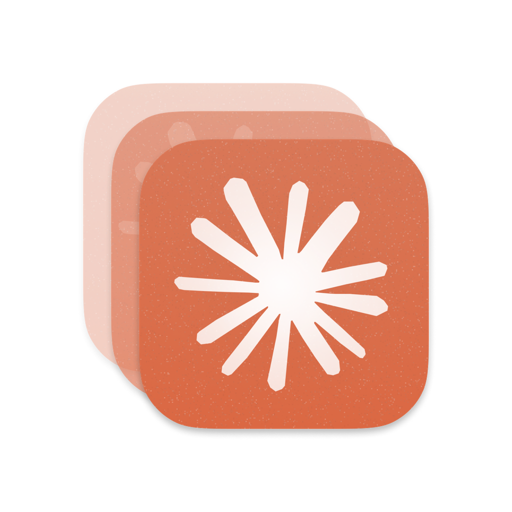
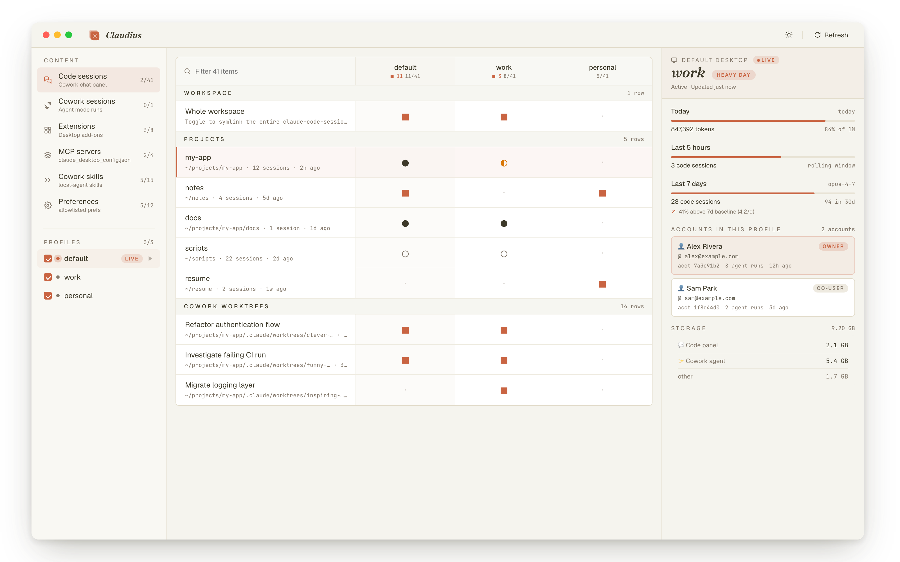

<p align="center">
  
</p>

<h1 align="center">Claudius</h1>

<p align="center">
  Multiple Claude Desktop and Claude Code accounts, side by side on macOS.
</p>

<p align="center">
  <a href="https://opensource.org/licenses/MIT"></a>
  <a href="https://github.com/democra-ai/claudius/releases"></a>
  <a href="https://www.apple.com/macos/"></a>
  <a href="https://v2.tauri.app/"></a>
</p>

<p align="center">
  
</p>

Each profile keeps its own login, chats, settings, MCP connectors, plugins, and skills. Open multiple Claude windows at once, each on a different account. Share extensions, MCP servers, and skills across profiles selectively, through a live matrix UI.

> **Unofficial community tool.** Uses public Electron flags (`--user-data-dir`) and an undocumented-but-stable Claude Code env var (`CLAUDE_CONFIG_DIR`) to isolate profiles. Not endorsed by Anthropic.

## Features

- **Side-by-side profiles** — fully isolated Desktop and Code accounts. Independent auth, chats, MCP, skills.
- **Live status** — sidebar polls every 10 s; the running profile gets a pulsing dot and a `LIVE` pill.
- **One click, two apps** — New Profile creates the Desktop launcher (`Claude WORK.app`) *and* the Code CLI alias (`claude-work`) in one step.
- **Selective sharing** — extensions and skills via live symlinks (edits propagate both ways); MCP servers and preferences via atomic copy-on-apply.
- **Matrix UI** — every profile × every content item in one grid. Five-state glyphs (■●◐○·) show share status at distance.
- **Profile detail** — today's tokens, rolling 5h / 7d session counts, pace vs your own baseline, account identities, storage breakdown, sharing graph.
- **CLI included** — the original interactive wizard is here too: `add`, `list`, `status`, `repair`, `remove`.

## Install

### App (recommended)

Grab the latest `.dmg` from **[Releases](https://github.com/democra-ai/claudius/releases/latest)** and drag **Claudius.app** to `/Applications`.

The build is unsigned, so first launch needs a right-click → **Open**, or:

```bash
xattr -dr com.apple.quarantine "/Applications/Claudius.app"
```

### CLI only

```bash
npm install -g github:democra-ai/claudius
```

Node 18+. The Code half works on Linux; the Desktop half is macOS-only because Claude Desktop is.

### Build from source

```bash
git clone https://github.com/democra-ai/claudius
cd claudius
npm install && npm run frontend:install
npm run tauri:dev      # GUI with hot reload
npm run tauri:build    # produces .app + .dmg
```

Requires Rust, Xcode CLT, Node 18+.

## Quick start

1. Open Claudius.
2. Sidebar bottom → **NEW PROFILE** → name it `work` → check ☑ Desktop + ☑ Code → click `+`.
3. `Claude WORK.app` lands in `~/Applications/`. Drag it to the Dock.
4. New terminal tab — the `claude-work` alias is live.
5. **Quit any other Claude window with Cmd+Q before first-launching the new profile** (the `claude://` auth deep link routes to whichever Claude is already running).

CLI equivalent: `claude-multiprofile add`.

## How it works

**Claude Desktop** is an Electron app and honors `--user-data-dir`, which relocates all app state (auth, chats, settings, MCP, projects) to a directory of your choosing. The launcher is a tiny AppleScript bundle: `open -n -a Claude --args --user-data-dir=/path/to/profile`. Different folder → different instance.

**Claude Code** honors the `CLAUDE_CONFIG_DIR` env var. The OAuth token in macOS Keychain is keyed by a SHA-256 of that path, so swapping the env var swaps the auth entirely.

**Sharing.** Two models. Extensions and skills are *symlinked* — edits propagate live both ways. MCP servers and preferences are *copy-on-apply* — you can't symlink a JSON key, so the value is written atomically (temp + rename) at Apply time.

<p align="center">
  
</p>

## The matrix

Rows are content items, columns are the profiles you've checked. Each cell encodes share state as both a glyph and a color (legible at distance and for colorblind users):

| Glyph | State | Meaning |
|-------|-------|---------|
| ■ | Shared | Live symlink between ≥ 2 profiles — edits propagate |
| ● | Copied | One-shot copy, currently aligned |
| ◐ | Diverged | Same item, different values across profiles |
| ○ | Independent | Present here, not aligned with any other profile |
| · | Absent | Not in this profile |

## CLI reference

```bash
claude-multiprofile add            # interactive wizard (Desktop, Code, or both)
claude-multiprofile list           # configured profiles + paths
claude-multiprofile status         # health-check directories, .apps, aliases
claude-multiprofile extensions <p> # multi-select copy Desktop extensions
claude-multiprofile repair <p>     # re-register macOS launcher (icon-cache fix)
claude-multiprofile remove <p>     # tear down a profile (data kept by default)
claude-multiprofile upgrade        # pull latest from GitHub
```

Pass `--help` to any command for flags.

## Tech stack

| Layer | Tool |
|-------|------|
| Desktop runtime | [Tauri 2](https://v2.tauri.app/) (Rust) |
| macOS chrome | [tauri-plugin-decorum](https://github.com/clearlysid/tauri-plugin-decorum) for single-row title bar + inset traffic lights |
| Frontend | React 18 + Vite + TypeScript |
| Styling | Tailwind CSS + [shadcn/ui](https://ui.shadcn.com/) |
| CLI | Node 18+ + [@inquirer/prompts](https://www.npmjs.com/package/@inquirer/prompts) |

## Comparison

| Tool | Desktop | Code | GUI | macOS | Linux |
|------|:-------:|:----:|:---:|:-----:|:-----:|
| **Claudius** | ✓ | ✓ | ✓ | ✓ | partial |
| [aimux](https://github.com/Digital-Threads/aimux) | — | ✓ | — | ✓ | ✓ |
| [aisw](https://crates.io/crates/aisw) | — | ✓ | — | ✓ | ✓ |
| [Jean-Claude](https://madewithlove.com/blog/running-multiple-claude-accounts-without-logging-out/) | — | ✓ | — | ✓ | ✓ |

## Security

Reads & writes only inside the per-profile data folders, the launcher `.app` bundles in `~/Applications/`, the registry at `~/.config/claude-multiprofile/`, and a delimited managed block in `~/.zshrc`. Never touches your default Claude install, macOS Keychain, IndexedDB / cookies, or anything else on disk. CLI has one runtime dep (`@inquirer/prompts`); the Tauri app's release bundle vendors its own runtime.

## Acknowledgments

- **[claude-multiprofile](https://github.com/jmdarre-v/claude-multiprofile)** (upstream, by jmdarre-v) — the CLI wizard, registry, macOS launcher generation, and shell-alias handling are derived from this MIT-licensed project. Preserved here under the same terms.
- **[tauri-plugin-decorum](https://github.com/clearlysid/tauri-plugin-decorum)** (by clearlysid) — the NSWindow Objective-C bindings that give us a proper single-row title bar with inset traffic lights.
- **Anthropic** — for Claude Desktop and Claude Code. Native multi-account is in their open feature requests ([Desktop](https://github.com/anthropics/claude-code/issues/32783), [Code](https://github.com/anthropics/claude-code/issues/18435)); this tool fills the gap until then.

## License

MIT — see [LICENSE](./LICENSE). Original copyright lines from the upstream fork are preserved.
